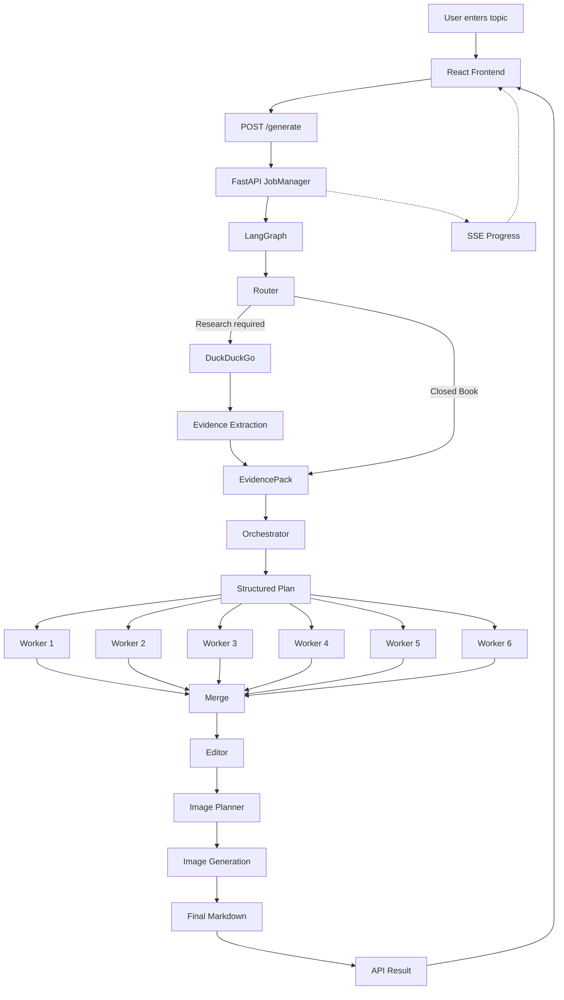

# ResearchFlow

> **ResearchFlow** is a full-stack AI research and blog-generation platform that transforms a user topic into a structured, research-backed Markdown article through an observable multi-agent workflow.

Built with **LangGraph, Groq, DuckDuckGo, FastAPI, React/Vite, SQLite checkpointing, Tenacity, SSE, and Pollinations.ai**.


---

## Quick Start

```powershell
git clone <https://github.com/Rajesh-snippet/ResearchFlow>
cd ResearchFlow

python -m venv .venv
.venv\Scripts\activate
pip install -r requirements.txt

cd frontend
npm install
cd ..
```

Add your Groq API key to a `.env` file in the project root:

```env
GROQ_API_KEY=#####
```

Run backend and frontend in two terminals:

```powershell
# Terminal 1
uvicorn app:app --reload

# Terminal 2
cd frontend
npm run dev
```

Open `http://localhost:5173`. Full setup details, including prerequisites and configuration, are in [Installation](#installation).

---

## Table of Contents

- [Overview](#overview)
- [Problem Statement](#problem-statement)
- [What ResearchFlow Solves](#what-researchflow-solves)
- [End-to-End Workflow](#end-to-end-workflow)
- [Detailed Workflow](#detailed-workflow)
- [Architecture](#architecture)
- [Key Features](#key-features)
- [Technology Stack](#technology-stack)
- [Project Structure](#project-structure)
- [Structured Outputs](#structured-outputs)
- [Reliability](#reliability)
- [Checkpointing and Resume](#checkpointing-and-resume)
- [API Endpoints](#api-endpoints)
- [Installation](#installation)
- [Configuration](#configuration)
- [Running Locally](#running-locally)
- [Example Request](#example-request)
- [Current Status](#current-status)
- [Limitations](#limitations)
- [Future Improvements](#future-improvements)
- [Development Milestones](#development-milestones)
- [Engineering Philosophy](#engineering-philosophy)
- [Conclusion](#conclusion)
- [License](#license)

---

## Overview

A simple AI writing application usually looks like:

```text
Topic → LLM → Article
```

ResearchFlow takes a different approach. It treats an LLM as one component inside a larger software system.

The workflow separates:

- research decisions
- evidence gathering
- planning
- section generation
- citation validation
- merging
- editing
- image planning
- image generation
- state management
- retries
- rate limiting
- checkpointing
- API execution
- user-facing progress

The result is an AI application that is easier to observe, debug, recover, and extend.

---

## Problem Statement

Generating an article with one large LLM prompt creates several practical problems.

### Lack of research control

The model must decide what to research while also writing the final answer.

### Weak evidence grounding

Current or externally verifiable claims may be generated without a dedicated evidence pipeline.

### Large prompts and outputs

Long articles increase input context, output tokens, latency, and provider costs.

### No progress visibility

A user sees a loading screen without knowing whether the system is researching, planning, writing, editing, or stuck.

### Failure wastes work

A long-running workflow can fail near the end and restart from the beginning.

### Parallelism creates provider pressure

Multiple workers reduce latency but can create simultaneous LLM requests and trigger rate limits.

### Free-form outputs are fragile

One graph stage needs predictable data from another. Unstructured model text makes this difficult.

---

## What ResearchFlow Solves

ResearchFlow decomposes content generation into specialized graph stages:

```text
User Topic
    ↓
Research Strategy
    ↓
Evidence Gathering
    ↓
Structured Planning
    ↓
Parallel Section Generation
    ↓
Citation Validation
    ↓
Content Merge
    ↓
Editing
    ↓
Image Planning
    ↓
Image Generation
    ↓
Final Markdown
```

The objective is **not** to claim that LLMs become perfectly factual.

The objective is to build engineering controls around probabilistic models.

---

## End-to-End Workflow



---

## Detailed Workflow

### 1. Topic submission

The React frontend sends:

```http
POST /generate
```

Example:

```json
{
  "topic": "AI agents in healthcare"
}
```

The API immediately creates a job and returns a `job_id`. It does not hold the HTTP request open for the entire AI workflow.

---

### 2. Job Manager

The FastAPI `JobManager` runs each pipeline as a background task.

It tracks:

- job ID
- thread ID
- status
- current node
- section progress
- errors
- result
- SSE subscribers

Typical states:

```text
queued → running → completed
```

or:

```text
queued → running → failed → resume → running → completed
```

---

### 3. Router

The Router determines:

- whether research is required;
- the research mode;
- the search queries.

The result is validated as a Pydantic `RouterDecision`.

Research modes:

```text
closed_book
hybrid
open_book
```

---

### 4. Research

When research is required:

```text
Search Query
    ↓
DuckDuckGo
    ↓
Raw Results
    ↓
Evidence Extraction
    ↓
EvidencePack
```

Evidence is represented using `EvidenceItem` fields such as:

```text
title
url
published_at
snippet
source
```

Results are deduplicated by URL.

In open-book mode, reliably dated stale sources can be filtered. Unknown dates are not guessed.

---

### 5. Orchestrator

The Orchestrator creates a structured `Plan`.

Each `Task` contains:

```text
id
title
goal
bullets
target_words
tags
requires_research
requires_citations
requires_code
```

The current schema validates:

```text
120 <= target_words <= 550
```

---

### 6. Parallel workers

LangGraph `Send` distributes tasks to workers.

```text
                 Orchestrator
                      |
          +-----------+-----------+
          |           |           |
          v           v           v
       Worker 1    Worker 2    Worker 3
          |           |           |
          v           v           v
       Worker 4    Worker 5    Worker 6
          |           |           |
          +-----------+-----------+
                      |
                    Merge
```

Each worker writes one Markdown section using the assigned task and available evidence.

Parallelism reduces latency, but concurrency is deliberately limited because parallel LLM calls increase token pressure.

---

### 7. Citation validation

Workers are instructed to cite only URLs supplied in their evidence.

`check_citations()` performs a sanity check to detect citations that were not part of the supplied evidence.

This is a validation signal, not a guarantee that every claim is factually correct.

---

### 8. Merge

The reducer collects worker outputs and restores the planned section order.

---

### 9. Editor

The editor performs a final pass for:

- readability
- consistency
- flow
- language quality

Citation preservation is also checked after editing.

---

### 10. Image planning and generation

The image planner creates structured `ImageSpec` objects containing:

```text
placeholder
filename
alt
caption
prompt
size
quality
```

The image stage uses Pollinations.ai and places generated images into the output flow.

---

## Architecture

```text
┌──────────────────────────────────────────────┐
│              React + Vite                    │
│ Topic Form | Progress | Pipeline | Result   │
└──────────────────────┬───────────────────────┘
                       │ REST + SSE
                       ▼
┌──────────────────────────────────────────────┐
│                  FastAPI                     │
│              Routes + JobManager             │
└──────────────────────┬───────────────────────┘
                       ▼
┌──────────────────────────────────────────────┐
│                 LangGraph                    │
│ Router → Research → Planner → Workers        │
│                         ↓                    │
│                      Reducer                 │
│                         ↓                    │
│                      Editor                  │
│                         ↓                    │
│                  Image Pipeline              │
└───────────────┬──────────────────┬───────────┘
                │                  │
                ▼                  ▼
              Groq             DuckDuckGo
                │
                ▼
              LLM
```

---

## Key Features

- Multi-agent LangGraph orchestration
- Closed-book, hybrid, and open-book modes
- Web research through DuckDuckGo
- Pydantic structured outputs
- Parallel section generation
- Citation sanity validation
- Dedicated editor stage
- Image planning and generation
- Tenacity retry with exponential backoff
- LLM concurrency limiting
- Job-level concurrency limiting
- SQLite checkpointing
- Resume support
- Async FastAPI execution
- Background jobs
- REST status polling
- Server-Sent Events
- React/Vite frontend
- Live pipeline progress

---

## Technology Stack

| Layer | Technology |
|---|---|
| Language | Python 3.11+ |
| Agent orchestration | LangGraph |
| LLM framework | LangChain |
| LLM provider | Groq |
| Current model | `openai/gpt-oss-120b` |
| Structured output | Pydantic + JSON Schema |
| Search | DuckDuckGo via `ddgs` |
| Retry | Tenacity |
| Backend | FastAPI |
| Server | Uvicorn |
| Async execution | asyncio + LangGraph `astream()` |
| Checkpointing | SQLite / LangGraph checkpoint |
| Frontend | React |
| Frontend tooling | Vite |
| Image generation | Pollinations.ai |
| Configuration | python-dotenv |

---

## Project Structure

```text
ResearchFlow/
│
├── app.py
├── main.py
├── graph.py
├── config.py
├── schemas.py
├── state.py
├── requirements.txt
├── README.md
├── .env.example
├── .gitignore
│
├── api/
│   ├── __init__.py
│   ├── routes.py
│   ├── schemas.py
│   └── job_manager.py
│
├── nodes/
│   ├── router.py
│   ├── research.py
│   ├── orchestrator.py
│   ├── workers.py
│   ├── editor.py
│   └── reducer/
│       ├── graph.py
│       ├── merge_content.py
│       ├── decide_images.py
│       └── generate_images.py
│
├── utils/
│   ├── constants.py
│   ├── logger.py
│   ├── rate_limiter.py
│   ├── retry.py
│   ├── text.py
│   └── validators.py
│
├── frontend/
│   ├── index.html
│   ├── package.json
│   ├── package-lock.json
│   ├── vite.config.js
│   └── src/
│       ├── App.jsx
│       ├── api.js
│       ├── index.css
│       ├── main.jsx
│       └── components/
│           ├── PipelineTrace.jsx
│           ├── PipelineTrace.css
│           ├── ProgressLog.jsx
│           ├── ResultView.jsx
│           └── TopicForm.jsx
│
├── outputs/
├── images/
└── researchflow_checkpoints.sqlite
```

---

## Structured Outputs

Important LLM responses are represented by Pydantic models:

```text
RouterDecision
EvidencePack
EvidenceItem
Plan
Task
ImageSpec
GlobalImagePlan
```

This creates deterministic validation boundaries between probabilistic LLM stages.

For example:

```python
class Task(BaseModel):
    id: int
    title: str
    goal: str
    bullets: list[str]
    target_words: int
```

---

## Reliability

### Retries

LLM calls use a centralized:

```python
invoke_with_retry(...)
```

wrapper using Tenacity and exponential backoff.

### LLM concurrency

`MAX_PARALLEL_LLM_CALLS` limits simultaneous LLM work.

### Job concurrency

`MAX_CONCURRENT_JOBS` limits complete ResearchFlow pipelines running simultaneously.

These are different:

```text
MAX_PARALLEL_LLM_CALLS
    → controls calls inside a workflow

MAX_CONCURRENT_JOBS
    → controls complete workflows
```

### Checkpointing

LangGraph state is persisted to SQLite so incomplete runs can resume.

---

## Checkpointing and Resume

The CLI uses `SqliteSaver`.

The async API uses `AsyncSqliteSaver`.

API jobs receive unique thread IDs:

```text
job-{job_id}-{slugified-topic}
```

Fresh execution:

```python
app.invoke(fresh_input, config)
```

Resume:

```python
app.invoke(None, config)
```

API resume endpoint:

```http
POST /jobs/{job_id}/resume
```

---

## API Endpoints

| Method | Endpoint | Purpose |
|---|---|---|
| `GET` | `/health` | Health check |
| `POST` | `/generate` | Create a generation job |
| `GET` | `/jobs/{job_id}` | Get job status |
| `GET` | `/jobs/{job_id}/stream` | Stream live progress |
| `GET` | `/jobs/{job_id}/result` | Retrieve final result |
| `POST` | `/jobs/{job_id}/resume` | Resume failed job |

Swagger:

```text
http://127.0.0.1:8000/docs
```

---

## Installation

### Prerequisites

- Python 3.11+
- Node.js
- npm
- Git

### Clone

```bash
git clone <your-repository-url>
cd ResearchFlow
```

### Python environment

```powershell
python -m venv .venv
.venv\Scripts\activate
```

### Python dependencies

```powershell
pip install -r requirements.txt
```

### Frontend dependencies

```powershell
cd frontend
npm install
cd ..
```

---

## Configuration

Create `.env` in the project root:

```env
GROQ_API_KEY=your_groq_api_key
```

Never commit `.env`.

Commit `.env.example` instead.

---

## Running Locally

### Backend

From the project root:

```powershell
uvicorn app:app --reload --host 127.0.0.1 --port 8000
```

Open:

```text
http://127.0.0.1:8000/docs
```

### Frontend

In another terminal:

```powershell
cd frontend
npm run dev
```

Open:

```text
http://localhost:5173/
```

---

## Example Request

Using Swagger:

```http
POST /generate
```

```json
{
  "topic": "AI agents in healthcare"
}
```

The response returns a `job_id`.

Monitor the job through:

```http
GET /jobs/{job_id}
```

or:

```http
GET /jobs/{job_id}/stream
```

---

## Current Status

The following have been verified locally:

- React/Vite startup
- FastAPI startup
- `/health`
- `/generate`
- JobManager
- LangGraph execution
- Router
- DuckDuckGo research
- Groq API communication
- Orchestrator
- parallel worker execution
- frontend/backend communication
- live progress
- SSE progress

A real frontend run reached:

```text
Writing section 6/6
```

This confirmed the main frontend → API → LangGraph → research → planning → worker path.

The primary current blocker for long complete runs is the token limit of the current free LLM provider configuration.

---

## Limitations

ResearchFlow is a working AI engineering prototype, but it is **not yet a production-grade autonomous research platform**.

### 1. Groq free-tier token limit

The current development configuration uses Groq's free tier.

During real testing, the system received:

```text
429 Too Many Requests
```

with an observed:

```text
TPM Limit: 8000
```

A representative failure reported:

```text
Used:      2672
Requested: 5700
Limit:     8000
```

This means the requested LLM call could not fit within the available token-per-minute budget.

One ResearchFlow run may involve:

```text
Router
Research extraction
Orchestrator
Worker 1
Worker 2
...
Worker 6
Editor
Image planner
```

Parallel workers can concentrate token usage within the same time window.

### Important

A blog word limit alone does **not** guarantee that the TPM limit will be respected.

LLM token consumption includes both:

```text
Input/context tokens
+
Generated output tokens
```

Future token optimization should therefore include:

- smaller prompts
- shorter evidence snippets
- fewer search results
- fewer evidence items per worker
- per-node output limits
- lower concurrency
- fewer unnecessary LLM calls
- optional image generation
- total job token budgeting

---

### 2. Publication-date uncertainty

Search results do not always provide reliable publication dates.

ResearchFlow does not guess dates, so some undated sources can remain in open-book research.

#
### 3. No authentication

The current API is designed for local development and portfolio demonstration.

It does not yet provide:

- user accounts
- authentication
- authorization
- API keys
- per-user quotas

### 4. Single-provider dependency

The current LLM integration is centered around Groq.

A provider abstraction would make switching between Groq, OpenRouter, OpenAI, Anthropic, or local models easier.


### 5. Image service dependency

Image generation depends on an external service. Availability, latency, and generated quality are outside ResearchFlow's control.

### 6. Parallelism versus cost

More parallelism reduces latency but increases token pressure, memory usage, and rate-limit risk.

---

## Future Improvements

### Token optimization

- Per-node `max_tokens`
- Total job token budgets
- Input-context trimming
- Evidence compression
- Shorter snippets
- Token usage telemetry
- Provider-aware budgeting
- Smarter worker concurrency

### Provider abstraction

Create a common LLM interface so graph nodes are not tied to one provider.

### Persistent jobs

Move job metadata from memory to PostgreSQL, Redis, or another durable store.

### Authentication

Add users, API keys, quotas, and authorization.

### Observability

Add:

- LangSmith tracing
- token metrics
- latency metrics
- node-level failure metrics
- cost estimation

### Frontend

Add:

- Markdown rendering
- source cards
- image previews
- downloads
- job history
- retry controls
- better error states
- responsive mobile design

### Deployment

Move local SQLite and in-memory job management to production-grade infrastructure.

---

## Development Milestones

### M1 — Core ResearchFlow

- LangGraph workflow
- Groq integration
- DuckDuckGo research
- Router
- Research
- Orchestrator
- Parallel workers
- Reducer

### M2 — Image Generation

- Pollinations.ai
- Image planning
- Image generation
- Markdown image placement

### M3 — Reliability and Validation

- Tenacity retries
- Citation validation
- Logging
- Shared utilities
- Pydantic validation
- Output organization

### M4 — Editor

- Dedicated editor node
- Citation preservation checks
- Final content polishing

### M5 — Checkpointing

- SQLite checkpoints
- Deterministic CLI thread IDs
- Resume behavior
- MessagePack module allowlist

### M5.5 — Rate Limit and Concurrency Control

- LLM semaphore
- `MAX_PARALLEL_LLM_CALLS`
- Retry/backoff integration
- Job-level concurrency planning

### M6 — Async API

- FastAPI wrapper
- Async LangGraph execution
- Background jobs
- Job IDs
- Polling
- SSE progress
- Async SQLite checkpointing
- Server-side resume
- `MAX_CONCURRENT_JOBS`

### Frontend

- React/Vite interface
- Topic submission
- Pipeline visualization
- Live progress log
- API integration
- Result interface

---

## Engineering Philosophy

ResearchFlow follows this principle:

> **Treat LLMs as probabilistic components inside a controlled software system.**

LLMs handle tasks where language reasoning is valuable:

```text
decision
research synthesis
planning
writing
editing
image planning
```

Application code handles:

```text
state
schemas
routing
validation
retries
concurrency
checkpointing
API execution
progress
file management
```

This separation makes the system easier to debug, extend, and eventually deploy.

The Groq free-tier limitation was discovered through real end-to-end testing and is documented rather than hidden. It is a real engineering constraint that motivates the next optimization stage.

---

## Conclusion

ResearchFlow demonstrates how an LLM application can evolve from a simple prompt into a complete software system.

It combines:

```text
LLMs
+
Structured outputs
+
Multi-agent orchestration
+
Parallel execution
+
Web research
+
Citation validation
+
Retries
+
Rate limiting
+
Checkpointing
+
Async APIs
+
SSE
+
React
```

The project is still evolving, but the architecture provides a foundation for a more scalable, observable, provider-independent AI research platform.

---

## License

This project is licensed under the [MIT License](LICENSE). 